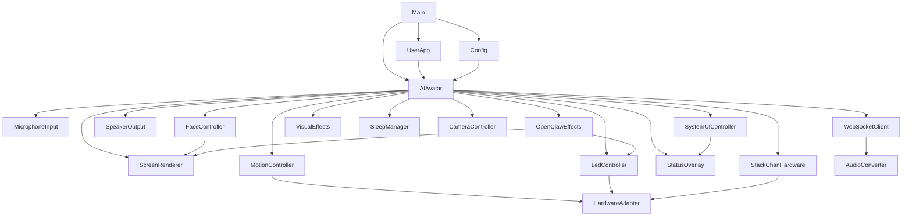

# AIAvatarStackChan

A framework for building voice-interactive AI robot with [StackChan (M5StackChan)](https://docs.m5stack.com/ja/StackChan) and [AIAvatarKit](https://github.com/uezo/aiavatarkit).

Turn your StackChan into a cute, smart buddy that talks with you, shows emotions, moves around, and even sees the world around it.


## ✨ Features

- 🗣️ **Voice conversation** — Ultra-low-latency streaming for smooth, natural conversations. Push-to-talk is also supported.
- 🧱 **Swappable building blocks** — STT, LLM, and TTS are all pluggable on the server side, so your robot can keep up with the latest and greatest.
- 🥰 **Expressive avatar** — Show a character face with multiple expressions, automatic blinking, and mouth animation synced to speech(lip sync).
- 👀 **Vision** — When the server needs visual context, StackChan snaps a photo and sends it along for multimodal conversations.
- 🦞 **AI agent integration** — Hook into agent harness systems like [OpenClaw](https://github.com/uezo/openclaw) to give your robot real-world skills that grow over time.


## 📦 Setup

AIAvatarStackChan runs as a pair:

- AIAvatarKit server
- StackChan firmware built with this framework

### Server

The server resources are in `examples/server`. Start by navigating there.

```sh
cd examples/server
```

Install requirements.

```sh
pip install -r requirements.txt
```

Set your OpenAI API key.

```sh
export OPENAI_API_KEY=sk-...
```

Start the server.

```sh
python -m uvicorn run:app --host 0.0.0.0 --port 8000
```

> **Note:** If you want your robot to speak Japanese, make sure [VOICEVOX](https://voicevox.hiroshiba.jp) is running before you start the server.

For server-side details, see [uezo/aiavatarkit](https://github.com/uezo/aiavatarkit).

### StackChan

Create a PlatformIO project and copy the example into it.

```sh
cp -r examples/stackchan/basic/src /path/to/your/project/
cp examples/stackchan/basic/platformio.ini /path/to/your/project/
```

Copy one of the sample configs as `config.json` and fill in your Wi-Fi credentials under `wifi_networks`.

```sh
cp config.sample.ja.json config.json   # or config.sample.json for English
```

Put `config.json` and at least one avatar image (`/avatar/neutral.png`) on the SD card, then insert it into your StackChan. You can use the sample images in `examples/avatar/stackchan` to test it quickly.

You can also place multiple resource profiles on one SD card. The standard `/config.json` and `/avatar` pair is treated as the `default` profile. Any matching `/<name>.json` and `/<name>` folder pair becomes a named profile:

```text
/config.json
/avatar/neutral.png
/kuroha.json
/kuroha/neutral.png
/miku.json
/miku/neutral.png
```

Select a fixed profile before loading the config:

```cpp
if (resources.beginSD(GPIO_NUM_4)) {
    resources.scanProfiles();
    resources.selectProfile("kuroha");
    resources.loadConfig(config);
}
```

If only one profile is found, `scanProfiles()` selects it automatically.

If you want to run without an SD card, create `Config` values in `main.cpp` and register optional built-in assets through `ResourceProvider`. SD files still take priority when an SD card is mounted.

```cpp
#include "BuiltinAvatarImages.h"

static aiavatar::Config config;
static aiavatar::ResourceProvider resources;
static aiavatar::AIAvatar avatar;

void setup() {
    strlcpy(config.wifiSsid, "your-ssid", sizeof(config.wifiSsid));
    strlcpy(config.wifiPass, "your-pass", sizeof(config.wifiPass));
    strlcpy(config.wsHost, "192.168.0.10", sizeof(config.wsHost));

    // Optional fallback images generated by examples/tools/embed_assets.py.
    resources.setBuiltinAssets(aiavatar::kBuiltinAssets, aiavatar::kBuiltinAssetsCount);

    if (resources.beginSD(GPIO_NUM_4)) {
        resources.loadConfig(config);
    }

    avatar.begin(config, resources);
}
```

To embed avatar images in firmware, generate a user-side asset file:

```sh
cd /path/to/your/project/src
/path/to/AIAvatarStackChan/examples/tools/embed_assets.py --input /path/to/AIAvatarStackChan/examples/avatar/stackchan
```

This writes `BuiltinAvatarImages.h` and `.cpp` next to your `main.cpp`, not into the library source tree. Include the generated header from your app:

```cpp
#include "BuiltinAvatarImages.h"
resources.setBuiltinAssets(aiavatar::kBuiltinAssets, aiavatar::kBuiltinAssetsCount);
```

Build and upload the firmware. Once StackChan boots and the 🛜Wi-Fi icon turns green, you're connected to the server — start chatting!


## 🎮 Usage

Here are the default controls built into the firmware.

- 🎙️ Toggles mute/unmute. While muted, long-press the screen to use push-to-talk.
- 🛜 Opens the Wi-Fi network picker and lets you toggle the WebSocket connection on/off.
- 🔈 No visible button, but tapping the lower-left corner of the screen cycles through speaker volume levels.
- 👀 Say something like "look at this" and StackChan will automatically snap a photo, send it to the server, and respond based on what it sees.
- 👋 Pet the top of StackChan's body and it will react with a cute response.
- ☝️ Swipe up on the screen to hide the clock and status icons. Swipe down from the top edge to bring them back.


## ⚙️ Configuration

`config.json` can define the following fields:

- `wifi_networks` (array): Wi-Fi profiles shown in the Wi-Fi menu. Up to 5 entries
  - `name` (string): menu display name
  - `ssid` (string): Wi-Fi SSID. Entries with an empty SSID are ignored
  - `pass` (string): Wi-Fi password
  - `sleep_wifi_mode` (string): optional per-network sleep Wi-Fi behavior. `sleep` or `off`
- `ws_host` (string): AIAvatarKit WebSocket server host
- `ws_port` (number): AIAvatarKit WebSocket server port
- `ws_path` (string): AIAvatarKit WebSocket server path
- `user_id` (string): user ID sent when connecting to the WebSocket server
- `channel` (string): channel name sent when connecting to the WebSocket server
- `timezone` (string): TZ string used for NTP time configuration
- `mic_sample_rate` (number): microphone input sample rate
- `mic_magnification` (number): microphone input gain setting
- `mic_buffer_samples` (number): microphone samples sent per frame. 1 to 2048
- `vad_threshold_db` (number): voice activity detection threshold in dB
- `playback_queue_depth` (number): audio playback queue depth
- `rbuf_samples` (number): legacy setting. Used only when `playback_queue_depth` is not set, converted in 512-sample units
- `start_threshold` (number): number of queued samples required before playback starts
- `drain_timeout_ms` (number): playback queue drain timeout in ms
- `speaker_volume` (number): initial speaker volume. 0 to 255
- `audio_normalize_target_peak` (number): target playback peak used for automatic audio normalization. 0.0 disables normalization, 1.0 targets full scale
- `audio_normalize_max_gain` (number): maximum gain multiplier applied by automatic audio normalization. Minimum 1.0
- `volume_levels` (array): volume values cycled by the volume button. 2 to 8 entries, each 0 to 255
- `audio_task_stack_size` (number): stack size for audio tasks
- `audio_task_core` (number): CPU core assigned to audio tasks
- `ws_task_stack_size` (number): stack size for the WebSocket task
- `ws_task_core` (number): CPU core assigned to the WebSocket task
- `ws_reconnect_interval_ms` (number): WebSocket reconnect interval in ms
- `mic_tx_slow_backoff_ms` (number): delay in ms when microphone transmission is congested
- `mic_tx_fail_backoff_ms` (number): delay in ms after microphone transmission fails
- `keepalive_interval_ms` (number): keepalive send interval in ms
- `display_rotation` (number): display rotation setting
- `display_brightness` (number): display brightness
- `sleep_enabled` (boolean): whether to enable idle sleep mode
- `sleep_timeout_ms` (number): idle time in ms before entering sleep
- `sleep_display_brightness` (number): display brightness while sleeping. 0 to 255
- `sleep_wifi_mode` (string): default sleep Wi-Fi behavior. `sleep` keeps Wi-Fi associated with modem sleep; `off` powers Wi-Fi down and reconnects on wake
- `status_overlay_enabled` (boolean): whether to show the status overlay
- `vision_preview_duration_ms` (number): camera preview duration for vision requests in ms. Default: `2000`
- `accepted_led_color` (array): RGB color for the accepted-state LED. Example: `[0, 168, 0]`
- `tool_led_color` (array): RGB color for the tool-running LED. Example: `[140, 0, 140]`
- `ptt_max_seconds` (number): maximum Push-to-Talk recording length in seconds
- `ptt_min_seconds` (number): minimum Push-to-Talk recording length sent to the server
- `ptt_hold_threshold_ms` (number): hold duration in ms required to start Push-to-Talk
- `pitch_home` (number): StackChan pitch home angle
- `stackchan_auto_angle_sync` (boolean): whether to synchronize StackChan posture from the physical servo position
- `nade_invoke_prompt` (string): prompt sent when StackChan touch/nade is detected
- `vision_invoke_prompt` (string): prompt sent with camera images
- `fast_startup` (boolean): whether to start the display, mic, and UI first, then defer Wi-Fi, WebSocket, speaker, and heavy image loading so the device becomes interactive sooner
- `debug_log` (boolean): whether to output debug logs

If `stackchan_auto_angle_sync` causes sudden servo jumps on your hardware, set it to `false`.


## 🧩 Hooks and Callbacks

Use callbacks on `AIAvatar` to add behavior without changing the framework internals.

Public user callbacks:

- `avatar.onSpeechDetected(aiavatar::SpeechDetectedCallback cb)`
  - Signature: `void (*)()`
  - Called when local microphone audio crosses the VAD threshold while the mic is unmuted, the WebSocket is connected, and the server is not processing. Calls are throttled to about once every 300 ms.
- `avatar.onNade(aiavatar::NadeCallback cb)`
  - Signature: `void (*)()`
  - Called after StackChan touch/nade is detected. The built-in nade prompt is still queued before the user callback runs.
- `avatar.onStart(aiavatar::TextCallback cb)`
  - Signature: `void (*)(const char* text)`
  - Called when the server starts a response. `text` is the request text reported by the server when available.
- `avatar.onFinal(aiavatar::FinalTextCallback cb)`
  - Signature: `void (*)(const char* responseText, const char* voiceText)`
  - Called when the server sends final text metadata. `responseText` is the final response text, and `voiceText` is the text used for voice output when available.
- `avatar.onToolCall(aiavatar::ToolCallCallback cb)`
  - Signature: `void (*)(const char* toolName)`
  - Called when the server reports a tool call. Built-in LED/OpenClaw effects run first, then the user callback runs.
- `avatar.onAccepted(aiavatar::SimpleCallback cb)`
  - Signature: `void (*)()`
  - Called when the server accepts a user input/request. Built-in playback interruption and accepted LED effects run first.
- `avatar.onOverlay(aiavatar::ScreenOverlayCallback cb)`
  - Signature: `void (*)(LGFX_Sprite* canvas)`
  - Called during display rendering so user code can draw on the shared canvas. Built-in visual effects, status overlay, and OpenClaw overlay are drawn before this callback; system UI is drawn after it.

Example:

```cpp
static void onToolCall(const char* toolName) {
    Serial.printf("tool: %s\n", toolName ? toolName : "");
}

static void drawOverlay(LGFX_Sprite* canvas) {
    canvas->setTextColor(TFT_WHITE);
    canvas->drawString("custom", 8, 8);
}

void setup() {
    // ...
    avatar.onToolCall(onToolCall);
    avatar.onOverlay(drawOverlay);
    avatar.begin(config);
}
```

Keep callbacks short and non-blocking. Long work should be moved to your own task or handled asynchronously.

`WebSocketClient`, `MotionController`, and `ScreenRenderer` also expose lower-level callback setters, but `AIAvatar::begin()` uses those internally. User code should prefer the `AIAvatar` callbacks above so it does not replace framework wiring.


## ⚡️ Event-Driven Speech

StackChan can speak in response to device-side events instead of waiting for user speech.

Use this when a local sensor, button, timer, or application event should make StackChan start a response. Internally, this is implemented by building a prompt on the device and sending it to the server as an `invoke` request. The built-in nade flow uses the same mechanism.

Public invoke APIs:

- `avatar.invokeText(const char* text)`: queues a text-only invoke request.
- `avatar.invokeWithVision(const char* text = nullptr)`: queues camera capture, preview, and an image invoke. Omit `text` to use `vision_invoke_prompt`, just like a server `vision` request. Text is copied when queued.

These return whether the request was queued, not whether it was sent. Vision accepts one pending request; it returns `false` if the camera is unavailable, a request is already queued, or the text exceeds 767 bytes. Capture and transmission run in the WebSocket task once connected.

Lower-level send APIs:

- `avatar.websocket().sendInvoke(const char* text)`: sends a text-only invoke request.
- `avatar.websocket().sendInvokeWithImage(const char* text, const char* imageDataUrl)`: sends a text prompt with an image file URL or data URL.
- `avatar.websocket().sendInvokeWithAudio(const int16_t* pcmData, size_t sampleCount)`: sends recorded PCM audio as an invoke request.

Example:

```cpp
static aiavatar::AIAvatar avatar;
static bool sensorWasActive = false;

void loop() {
    avatar.update();

    bool sensorActive = readYourSensor();
    if (sensorActive && !sensorWasActive && avatar.isConnected()) {
        struct tm ti;
        time_t now = time(nullptr);
        localtime_r(&now, &ti);

        char prompt[512];
        snprintf(prompt, sizeof(prompt),
                 "$A local sensor was triggered. React with one short phrase.\n\n"
                 "Current date and time: %04d-%02d-%02d %02d:%02d:%02d",
                 ti.tm_year + 1900, ti.tm_mon + 1, ti.tm_mday,
                 ti.tm_hour, ti.tm_min, ti.tm_sec);

        avatar.websocket().sendInvoke(prompt);
    }

    sensorWasActive = sensorActive;
    delay(1);
}
```

Keep invoke triggers edge-based or rate-limited. Sending an invoke every loop iteration will flood the server queue.


## 🎛️ Virtual Buttons

CoreS3 has no physical front buttons, so the framework provides virtual touch areas.

Default actions:

- Virtual Button A: lower-left touch area, volume cycle
- Virtual Button B: no action
- Virtual Button C: no action

For devices with physical buttons, disable virtual buttons and forward clicks yourself:

```cpp
avatar.systemUI().setVirtualButtonsEnabled(false);

if (M5.BtnA.wasClicked()) {
    avatar.systemUI().runButtonAction(aiavatar::ButtonId::A);
}
```

Available actions:

- `ButtonAction::None`
- `ButtonAction::VolumeCycle`
- `ButtonAction::Stop`
- `ButtonAction::WebSocketToggle`
- `ButtonAction::MicToggle`


## 💤 Sleep Mode

Sleep mode reduces idle power use by dimming the display and optionally reducing Wi-Fi power after a period without user activity, speech playback, Push-to-Talk, or server processing.

Enable it in `config.json`:

```json
{
  "sleep_enabled": true,
  "sleep_timeout_ms": 60000,
  "sleep_display_brightness": 32,
  "sleep_wifi_mode": "sleep"
}
```

Or set it directly in firmware code:

```cpp
config.sleepEnabled = true;
config.sleepTimeoutMs = 60000;
config.sleepDisplayBrightness = 32;
config.sleepWifiMode = aiavatar::SleepWifiMode::Sleep;
```

Wi-Fi behavior:

- `sleep`: enables Wi-Fi modem sleep while keeping the connection state. Wake is usually immediate. If the WebSocket was disconnected while sleeping, the framework reconnects it on wake.
- `off`: disconnects the WebSocket, powers Wi-Fi off, and reconnects to the Wi-Fi profile that was active when sleep started. This saves more power, but wake takes longer and some mobile tethering access points may stop advertising while the device is disconnected.

You can override Wi-Fi sleep behavior per network:

```json
{
  "sleep_wifi_mode": "off",
  "wifi_networks": [
    {
      "name": "Home",
      "ssid": "home-ssid",
      "pass": "home-password",
      "sleep_wifi_mode": "off"
    },
    {
      "name": "Mobile",
      "ssid": "phone-tethering",
      "pass": "mobile-password",
      "sleep_wifi_mode": "sleep"
    }
  ]
}
```

`SleepManager` is owned by `AIAvatar`. Once `sleep_enabled` is true, `avatar.begin(config)` initializes sleep handling and `avatar.update()` manages the sleep timer, display brightness, Wi-Fi mode, and WebSocket reconnects. User code does not need to create a `SleepManager`.

> **Note:** When `fast_startup` is enabled, sleep waits until deferred startup is complete. If the device cannot connect to Wi-Fi during startup, deferred startup may remain incomplete and sleep mode will not start. This is intentional for now so sleep does not interrupt partially initialized startup work.

Built-in activity sources automatically reset the sleep timer:

- Touch handled by `SystemUIController`
- Push-to-Talk through `avatar.startPushToTalk()` / `avatar.endPushToTalk()`
- Volume, microphone, WebSocket, Wi-Fi menu, and stop actions routed through `AIAvatar` / `SystemUIController`
- Server response start, tool calls, vision requests, accepted events, and StackChan nade events
- Speech playback while the speaker is playing, plus playback end

For app-specific input that the framework cannot see, call `avatar.resetSleepTimer(reason)` before or during the action:

```cpp
if (M5.BtnA.wasClicked()) {
    avatar.resetSleepTimer("button A");
    avatar.cycleVolume();
}
```

For long-running app work, keep the main loop non-blocking and reset the sleep timer while that work is active. Track the task state in your app, then call `avatar.resetSleepTimer("your work")` from `loop()` at a modest interval:

```cpp
uint32_t lastSleepResetMs = 0;

void loop() {
    avatar.update();
    userApp.update();

    if (millis() - lastSleepResetMs >= 1000) {
        lastSleepResetMs = millis();
        if (userApp.isLongTaskRunning()) {
            avatar.resetSleepTimer("long task");
        }
    }

    delay(1);
}
```

Touch wake behavior is intentionally conservative. If the device is already sleeping, the first screen tap wakes the display and Wi-Fi state, then the current tap event is consumed so it does not also trigger a UI action. If the user keeps holding the screen, the next update cycles can still start touch Push-to-Talk after the hold threshold. Physical buttons or app-specific inputs should call `avatar.resetSleepTimer(...)` and then run their normal action, so a button press can wake and perform its intended function.


## 🛠️ Customization

You can add project-specific behavior directly in `main.cpp`, or keep it in a separate application module.

`examples/stackchan/custom` shows the module-based approach. It reads temperature and humidity from [Unit ENV III](https://docs.m5stack.com/en/unit/envIII) and draws the values on the screen.

The custom behavior is isolated in `UserApp.cpp` / `UserApp.h`. `main.cpp` creates the `UserApp` instance, calls `userApp.begin(avatar)` during setup, and calls `userApp.update()` from the main loop.

Use this example as a starting point for app-specific sensors, overlays, callbacks, and event-driven speech.


## 🤿 Architecture Deep Dive



`AIAvatar` is the central orchestrator. It owns the audio pipeline, WebSocket connection, display rendering, face control, motion control, LEDs, system UI, and user callbacks.

| Module | Role |
| --- | --- |
| `Config` | Holds runtime settings and can load JSON from a stream or bytes. |
| `ResourceProvider` | Resolves config/assets from SD first, supports SD resource profiles, then optional user-registered built-in assets. |
| `MicrophoneInput` | Captures PCM audio from CoreS3 and queues frames for upload. |
| `WebSocketClient` | Sends microphone frames and invoke requests, then receives server events and audio chunks. |
| `SpeakerOutput` | Buffers and plays returned PCM audio. |
| `ScreenRenderer` | Owns the display canvas and calls overlay rendering hooks. |
| `FaceController` | Handles expressions, blinking, and lip-sync state. |
| `MotionController` | Drives StackChan head motion and nade motion sequences. |
| `LedController` | Drives StackChan LED feedback. |
| `SystemUIController` | Handles virtual buttons, Wi-Fi selection UI, and built-in button actions. |
| `StatusOverlay` | Draws connection, Wi-Fi, battery, volume, and microphone status. |
| `VisualEffects` | Draws transient UI effects such as voice detection. |
| `SleepManager` | Manages idle sleep, display dimming, Wi-Fi sleep/off behavior, wake handling, and WebSocket reconnect after wake. |
| `CameraController` | Captures camera images for vision requests. |
| `OpenClawEffects` | Adds optional OpenClaw-specific LED and screen effects. |
| `HardwareAdapter` | Abstracts hardware-specific motion and LED operations. |
| `StackChanHardware` | Implements `HardwareAdapter` for StackChan hardware. |
| `AudioConverter` | Optional encoder/decoder hook used by `WebSocketClient`. |
| `UserApp` | Project-specific extension point used by the custom example for sensors, overlays, callbacks, and app logic. |

The hardware-dependent pieces are isolated behind `HardwareAdapter`, so the core voice/avatar flow can still run without StackChan motion, touch, LEDs, or camera.


## ⏱️ StopWatch

- StopWatch has no SD card slot, so put Wi-Fi, WebSocket, user ID, volume, and other settings directly in `examples/stopwatch/src/main.cpp`.
- Register Wi-Fi profiles with `addWifiNetwork(index, name, ssid, pass)`. The first entry is used for the initial connection and all entries appear in the Wi-Fi picker.
- Convert avatar images into firmware assets before building:

  ```sh
  cd examples/stopwatch/src
  ../../tools/embed_assets.py --input ../../avatar/stopwatch
  ```

- The generated `BuiltinAvatarImages.h/.cpp` must stay next to `main.cpp`, and `main.cpp` must include `BuiltinAvatarImages.h` and call `resources.setBuiltinAssets(...)`.
- Keep only the images you need. Firmware-embedded PNGs increase flash usage, so large or unused avatar files should be removed before conversion.
- StopWatch speaker output can be quieter than StackChan. The example applies `avatar.speaker().setPcmGain(6.0f)` in `main.cpp`; adjust it to match your TTS voice and hardware.
- Press `BtnA` to cycle speaker volume. The current volume level is shown briefly on screen.
- Hold `BtnB` for Push-to-Talk, then release it to send the recorded audio.
- Tap the face area to send a short text invoke. This is rate-limited to avoid accidental repeated taps.
- The screen orientation flips automatically when the device is worn upside down.
- When using the OpenClaw example server, matching OpenClaw response messages trigger a short vibration.


## 👻 Known Issues

We are aware of the following issues. Contributions are very welcome if you can help fix them.✨🙏✨

- Servo instability: The head may occasionally jerk left or drop downward. This may vary from unit to unit. Setting `stackchan_auto_angle_sync` to `false` in `config.json` can solve it, but motion becomes less responsive. To keep angle sync enabled, see the temporary StackChan-BSP workaround below.
- Arduino IDE support: We would like to support Arduino IDE and similar environments so beginners (like me) can use this project more easily.

### Temporary StackChan-BSP servo fallback

With StackChan-BSP 1.0.1, a failed servo position read can be converted into an extreme angle before the value is clamped. This can make the head suddenly jerk left or downward. Until the upstream library handles invalid reads, you can keep `stackchan_auto_angle_sync` enabled and use the BSP's current internal animation angle only when `ReadPos()` fails.

This fallback must be applied inside StackChan-BSP because its public motion API no longer exposes the raw read error. After PlatformIO has installed the dependencies, open:

```text
.pio/libdeps/<environment>/StackChan-BSP/src/M5StackChan.cpp
```

Replace `ScsServo::getCurrentAngle()` with:

```cpp
int getCurrentAngle() override
{
    int current_pos = _scs_bus.ReadPos(_config.id);
    int read_error  = _scs_bus.getErr();
    bool raw_valid  = read_error == 0 &&
                      current_pos >= _config.rawPosLimit.x &&
                      current_pos <= _config.rawPosLimit.y;

    if (!raw_valid) {
        int fallback_angle = uitk_intl::clamp(
            Servo::getCurrentAngle(), getAngleLimit().x, getAngleLimit().y);
        ++_position_read_fallback_count;
        Serial.printf(
            "[StackChan][position-fallback] servoId=%d count=%lu "
            "uptimeMs=%lu raw=%d readError=%d fallbackAngle=%d\n",
            _config.id,
            static_cast<unsigned long>(_position_read_fallback_count),
            static_cast<unsigned long>(millis()),
            current_pos, read_error, fallback_angle);
        return fallback_angle;
    }

    int angle = (current_pos - _zero_pos) * 5 * 10 / 16;
    return uitk_intl::clamp(
        angle, getAngleLimit().x, getAngleLimit().y);
}
```

Also add this member to the private section of `ScsServo`:

```cpp
uint32_t _position_read_fallback_count = 0;
```

The log reports each fallback and its cumulative count for the current boot. Servo ID 1 is yaw and ID 2 is pitch:

```text
[StackChan][position-fallback] servoId=1 count=3 uptimeMs=1418611 raw=-1 readError=1 fallbackAngle=42
```

This workaround does not retry, so it adds no delay beyond the driver's existing read timeout. It prevents an invalid position from becoming an extreme angle, but it does not repair the underlying servo communication problem.

Edits under `.pio` are temporary and will be lost if PlatformIO reinstalls the dependency or the directory is deleted. Reapply the patch when necessary, and remove it after an upstream StackChan-BSP release includes the fix. Upstream progress can be followed in [StackChan-BSP PR #5](https://github.com/m5stack/StackChan-BSP/pull/5).


## ❤️ Thanks

First and foremost, huge respect and heartfelt thanks to all the creators who brought StackChan to life and have built such a wonderful community around it. We also want to thank the M5Stack team for making StackChan more accessible to everyone by turning it into a product.


## ⚖️ License

This project is licensed under the MIT License. See [LICENSE](LICENSE) for details.
